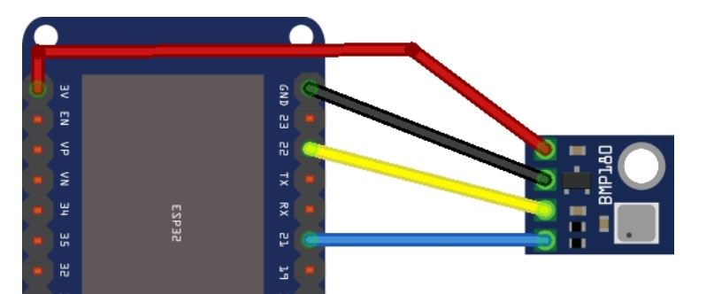

# BZTG_BMP-180

Der BMP180 ist ein Sensor von Bosch zur Messung von Temperatur und Luftdruck.

__Aufgabe 1__

Ermitteln Sie in welchem Temperaturbereich und Luftdruckbereich der Sensor mit welcher Genauigkeit misst.

Lösung:


__Aufgabe 2__

Wie wird der Sensor an den ESP32 angeschlossen? Zeichnen Sie ein Schaltbild (Skizze reicht). Wie muss die Spannungsversorgung erfolgen?

Lösung:



__Aufgabe 3__

Erstellen Sie ein Programm, welches die Temperatur und den Luftdruck alle 10 Sekunden misst und auf der Konsole ausgibt.

Lösung:

    ```python
    from bmp180 import BMP180                               # import bmp180 libary
    from machine import Pin, SoftI2C                        # create an I2C bus object accordingly to the port you are using
    import time                                             # import time module
    bus =  SoftI2C(scl=Pin(22), sda=Pin(21), freq=100000)   # create Software I2C Bus on Pins 22, 21
    bmp180 = BMP180(bus)                                    # initiate sensor
    bmp180.oversample_sett = 2                              # set oversample
    bmp180.baseline = 101325                                # set pressure baseline (1013,25hPa)

    while True:                                             # infinite loop
        print("\n\n")
        temp = bmp180.temperature                           # read sensor temperature
        p = (bmp180.pressure) / 100                         # read sensor pressure (hPa)

        print("Temperature: %d °C" %temp)                   # print temperature
        print("Pressure: %d hPa" %p)                        # print pressure
        
        time.sleep(10)                                      # delay 10s
    ```

Output: 

    Temperature: 22°C
    Pressue: 1021 hPa